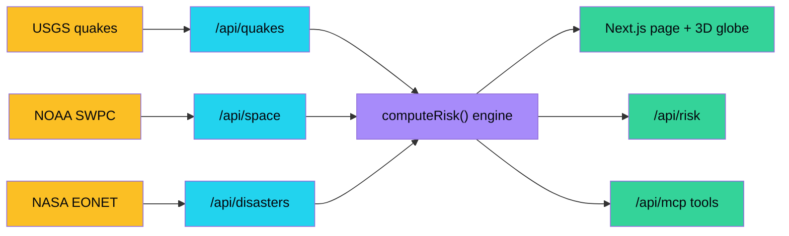
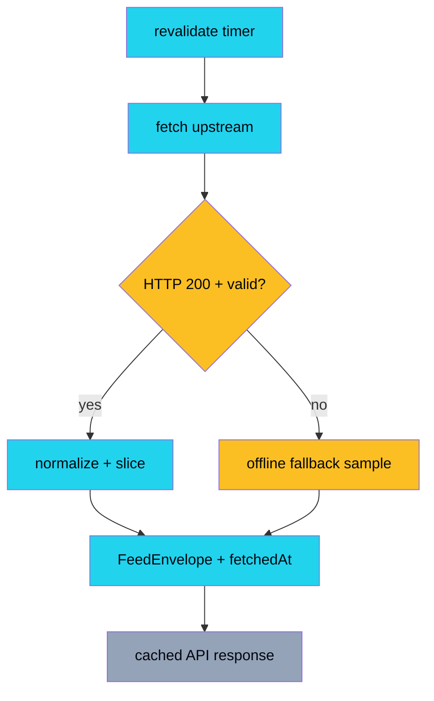
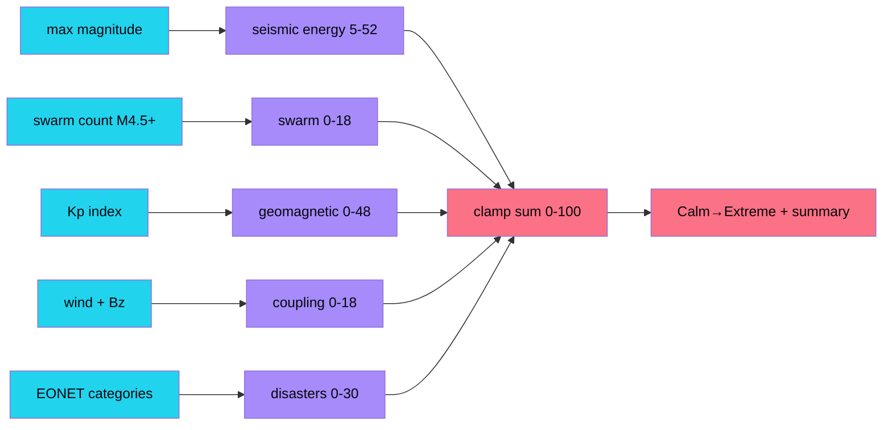
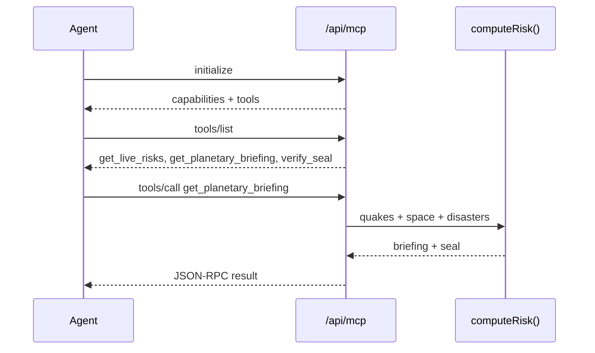
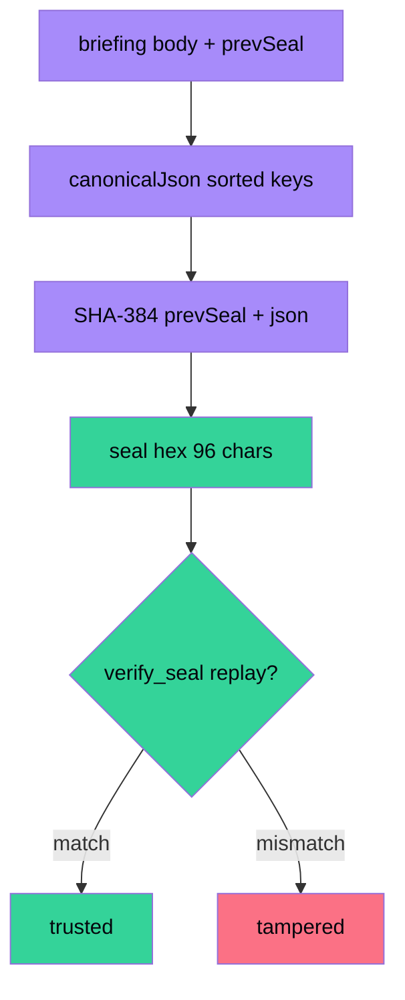
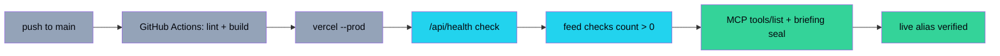
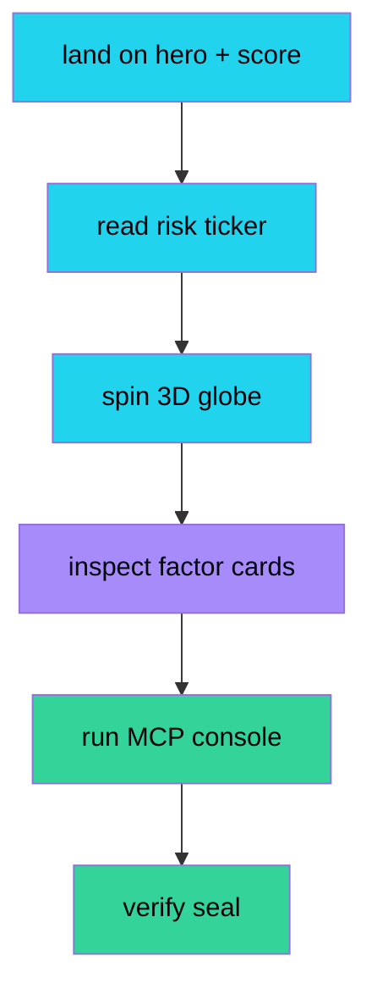
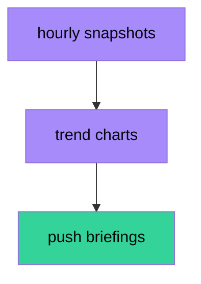
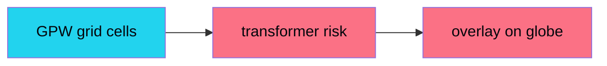

<div align="center">

# 🛰️ PulseGrid

**Live planetary risk intelligence — space weather × earthquakes × wildfires fused into one deterministic, hash-sealed Instability Index with MCP agent tools.**

[](https://pulsegrid.vercel.app)
[](./LICENSE)
[](https://nextjs.org)
[](#-data-feeds)
[](#-agent-interface)

[Live App](https://pulsegrid.vercel.app) · [API](https://pulsegrid.vercel.app/api/risk) · [MCP](https://pulsegrid.vercel.app/api/mcp) · [Issues](https://github.com/aniruddhaadak80/pulsegrid/issues)

</div>

## ✨ Features

- 🌍 **Library-grade 3D globe** (`react-globe.gl`): live quake points + pulse rings, disaster markers, solar-storm arcs, auto-rotate that pauses when you grab it
- ⚡ **3 live public feeds** (zero API keys): USGS earthquakes, NOAA space weather, NASA EONET disasters — cached API routes + sealed offline fallbacks
- 🧮 **Deterministic Instability Index 0–100** with itemized factors — the same function serves the UI, REST, and MCP
- 🤖 **MCP JSON-RPC** (`initialize` / `tools/list` / `tools/call`) + live in-page console proving it with one click
- 🔗 **Hash-chained seals** `SHA-384(prevSeal ‖ canonicalJson)` verifiable by replay
- 🌑 Dark-first glass design, live ticker, stats row, numbered narrative, custom scrollbar

## 🏗️ System architecture



## 🌊 Data-pipeline flow

Each feed is fetched server-side with timeout + normalization; any failure falls back to a sealed offline sample so the build, demo, and first paint never break.



## 🧮 Engine / algorithm flow



## 🤖 Agent (MCP) sequence



## 🔗 Integrity / seal chain



## 🚀 Deployment pipeline



## 🧭 User-journey flow



## 🚀 Quickstart

```bash
git clone https://github.com/aniruddhaadak80/pulsegrid.git
cd pulsegrid
npm install
npm run dev   # zero env vars — open http://localhost:3000
```

## 🔌 API

```bash
curl https://pulsegrid.vercel.app/api/health
curl https://pulsegrid.vercel.app/api/quakes
curl https://pulsegrid.vercel.app/api/space
curl https://pulsegrid.vercel.app/api/disasters
curl https://pulsegrid.vercel.app/api/risk
curl -X POST https://pulsegrid.vercel.app/api/mcp \
  -H 'content-type: application/json' \
  -d '{"jsonrpc":"2.0","id":1,"method":"tools/list"}'
curl -X POST https://pulsegrid.vercel.app/api/mcp \
  -H 'content-type: application/json' \
  -d '{"jsonrpc":"2.0","id":2,"method":"tools/call","params":{"name":"get_planetary_briefing","arguments":{}}}'
```

Agent setup (`mcp.json` block — full manifest in `public/mcp.json`):

```json
{
  "mcpServers": {
    "pulsegrid": { "url": "https://pulsegrid.vercel.app/api/mcp", "transport": "json-rpc" }
  }
}
```

## 📁 Project map

| Path | What |
|---|---|
| `src/app/page.tsx` | Server page: fetches feeds, computes risk, numbered sections |
| `src/components/GlobeView.tsx` | `react-globe.gl` client globe (dynamic `ssr:false`) |
| `src/components/GlobeSection.tsx` | Client wrapper for the dynamic globe |
| `src/components/Hero.tsx` / `McpConsole.tsx` | Animated hero + one-click MCP proof |
| `src/lib/engine.ts` | Deterministic Instability Index (UI = API = MCP) |
| `src/lib/feeds.ts` / `fallback.ts` / `types.ts` | Live fetchers, offline samples, types |
| `src/lib/seal.ts` | SHA-384 chain + verify |
| `src/app/api/*/route.ts` | `health, quakes, space, disasters, risk, mcp` |

## 📡 Data feeds

- USGS Earthquake Hazards Program — `earthquake.usgs.gov` (GeoJSON, updated every minute)
- NOAA Space Weather Prediction Center — `services.swpc.noaa.gov` (K-index, plasma, mag)
- NASA EONET v3 — `eonet.gsfc.nasa.gov` (open wildfires, storms, volcanoes)

> ⚠️ Safety note: PulseGrid is an educational demo, not an official warning system. For real emergencies follow USGS / NOAA / local authorities.

## 🗺️ Roadmap

- [x] **Now — live + sealed + agentic** (this release: wow outcome = 10-second globe demo + one-click agent proof)
- [ ] **Next — alerts + history** (wow outcome = subscribe to a place and get a sealed push briefing)
- [ ] **Later — grid impact model** (wow outcome = per-grid-cell transformer/GPS risk overlay)






## 🤝 Contributing

See [CONTRIBUTING.md](./CONTRIBUTING.md). MIT licensed — see [LICENSE](./LICENSE). Security notes in [SECURITY.md](./SECURITY.md).
